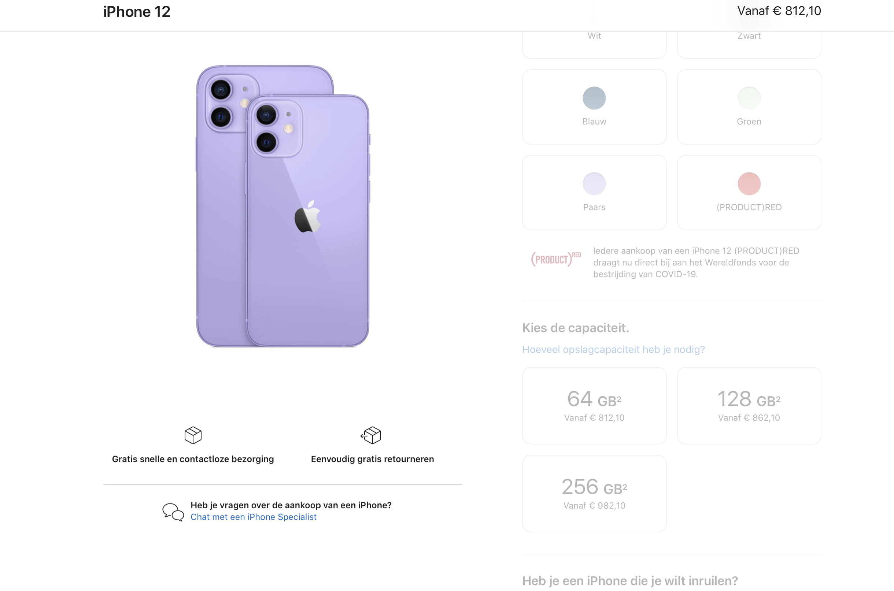

# Procesverslag

Markdown is een simpele manier om HTML te schrijven.  
Markdown cheat cheet: [Hulp bij het schrijven van Markdown](https://github.com/adam-p/markdown-here/wiki/Markdown-Cheatsheet).

Nb. De standaardstructuur en de spartaanse opmaak van de README.md zijn helemaal prima. Het gaat om de inhoud van je procesverslag. Besteedt de tijd voor pracht en praal aan je website.

Nb. Door _open_ toe te voegen aan een _details_ element kun je deze standaard open zetten. Fijn om dat steeds voor de relevante stuk(ken) te doen.

## Jij

uitwerken voor kick-off werkgroep

### Auteur:

Jochem Geuze

#### Je startniveau:

Blauwe

#### Je focus:

Surface

## Je website

uitwerken voor kick-off werkgroep

### Je opdracht:

https://www.apple.com/nl/shop/buy-iphone/iphone-12

#### Screenshot(s) van de eerste pagina (small screen):

verkoop pagina (druk op cmd shift + r om alle foto's makkelijk te kopieren)  

#### Screenshot(s) van de tweede pagina (small screen):

vergelijken telefoons

## Breakdownschets (week 1)

uitwerken na afloop 2e werkgroep

### de hele pagina:

### dynamisch deel (bijv menu):

### wellicht nog een dynamisch deel (bijv filter):

## Voortgang 1 (week 2)

uitwerken voor 1e voortgang

### Stand van zaken

Code zag er goed uit, meer gebruik maken van comments in m'n html en css. En even nagaan hoe belangrijk het is om nth te gebruiken ipv classes. Want dat kan ik nog verbeteren.

## Voortgang 2 (week 3)

uitwerken voor 2e voortgang

### Stand van zaken

Alle html stond er inmiddels in, maar ik had sommige h5 en h6 genoemd en die moet ik veranderen naar h2 en h3. Er is al een begin van css en dit gaat al goed. Eerste deel van index.html staat er al goed in.

## Toegankelijkheidstest (week 4)

uitwerken na test in 8e voortgang

### Leesbaarheid

Contrast op index.html is goed. Tekst is allemaal goed leesbaar en als je de pagina vergroot is het zeker prima te doen.

#### Keyboard navigatie

Alle buttons- en a-elementen worden goed opgepakt als je tab gebruikt. Sommige tekst wordt wel overgeslagen, maar buttons en linkjes zijn goed te gebruiken.

#### Test met trillende hand

Bij de test of mijn website goed te bedienen is voor iemand met een fysieke beperkingen aan de handen, kwam er uit dat sommige knopjes wel klein zijn. Het was een beetje priegelen en de buttons met kleuren waren eigenlijk gewoon te klein.

## Voortgang 3 (week 4)

uitwerken voor 3e voortgang

### Stand van zaken

Css van index.html staat er al, header en footer staan ook beide maar de opmaak van vergelijken.html is nog niet goed genoeg. En ik heb teveel classes en er staan teveel sections in sections, dus deze moet ik zoveel mogelijk verwijderen of eventueel vervangen met articles.

## Eindgesprek (week 5)

uitwerken voor eindgesprek

### Stand van zaken

Ik heb eigenlijk alles wat ik wilde zo goed als mogelijk gefixt, alleen de navigatie-knop werkt uiteindelijk niet zoals ik wil helaas. Ook werken bij de vergelijken pagina

### Screenshot(s)

hier screenshot(s) van je eindresultaat

## Bronnenlijst

continu bijhouden terwijl je werkt

Nb. Wees specifiek ('css-tricks' als bron is bijv. niet specifiek genoeg).

1. bron 1
2. bron 2
3. ...

